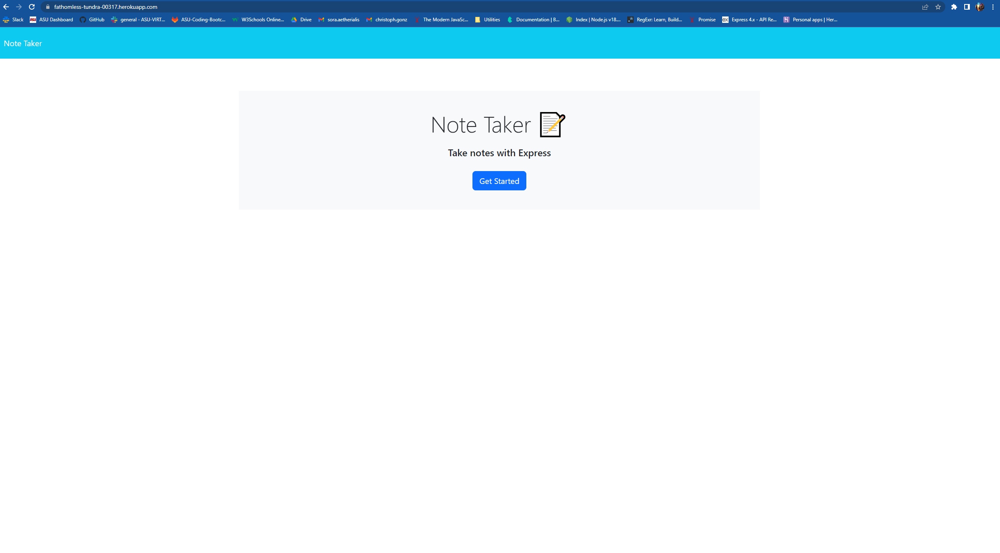
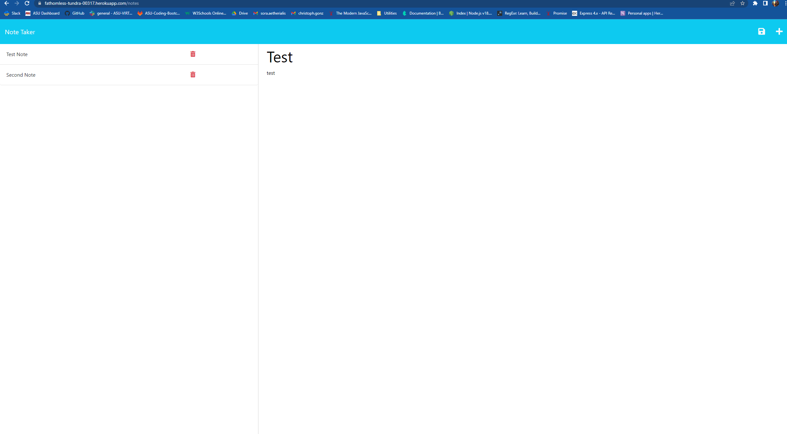

# c11-note-taker

## Description

This is an application that allows the user to view and create notes on a hosted website. This is a helpful organizational tool that can allow you to keep track of important things
to help your efficiency. It was helpful to create this application in order to familiarize myself with express and understand how to handle requests.

## Installation

It is required to use this application with node and npm. The required dependencies are Express and random-id which will be installed by using npm.
With the files in the desired directory, you can install the above dependencies through an "npm install"

## Usage

It is required to host this application online, through a hosting the server online or through localHost at your desired port.
After navigating to the site and clicking the getting started button, you can create the notes by filling in the relevant sections.
You can then save the note by pressing the save icon in the uppper right corner. You can select the note you would like to see by pressing the note on the left hand side.
You can also delete notes that you no longer need by pressing the trash icon.

The site is hosted at the following url:
https://fathomless-tundra-00317.herokuapp.com/

